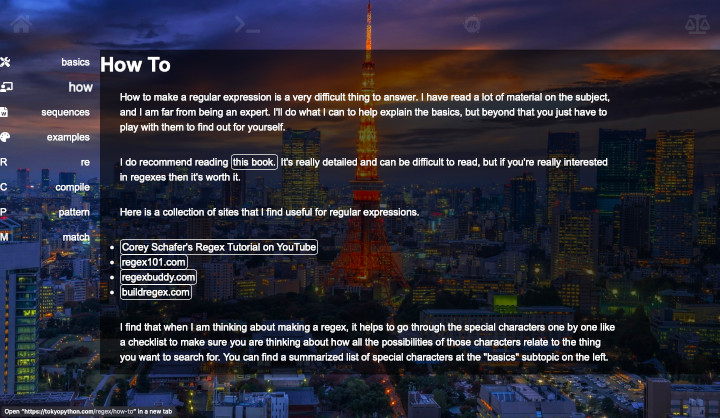

# [Tokyo Python Website](https://tokyopython.com)
A website for Python in Tokyo.

## Purpose/Goal
Serves as a place for me to keep an abridged collection of notes on the official documentation. Also will act as a kind of bulletin board for Python related events in the Tokyo area. This is an ongoing side project with no real deadline.

## Tech/Libraries Used
* HTML
* CSS
* JavaScript
* React

## Problems/Solutions
N/A

## More Information
N/A
